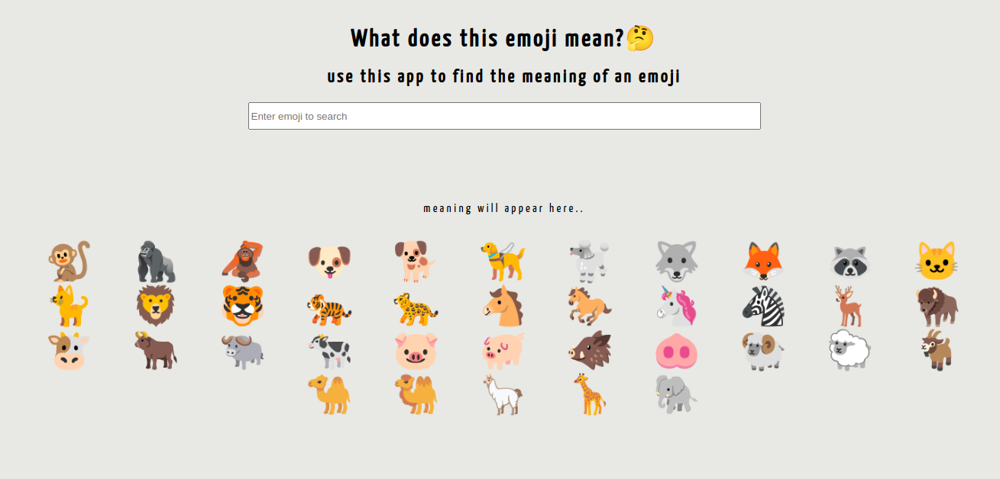

# neoG - Mark-8 CLI Quiz App

This is a solution to the [Mark-8 of neoG camp](https://neog.camp/guide/lesson-five).

## Table of contents

- [Overview](#overview)
  - [The challenge](#the-challenge)
  - [Screenshot](#screenshot)
  - [Links](#links)

## Overview
- A simple emotion intepretor. It tells you meaning of emoji.

### The challenge
- Learn react
- create react app in codesandbx
- write first jsx component
- use an input element and put an onChange event
- update the value using useState
- create object to put all emoji data at one place
- get data based on key, show that data in view using useState

### Screenshot

### Links

[- Live Site URL](https://codesandbox.io/embed/github/git-0r/mark8_emojiApp/tree/main/?fontsize=14&hidenavigation=1&theme=dark)
